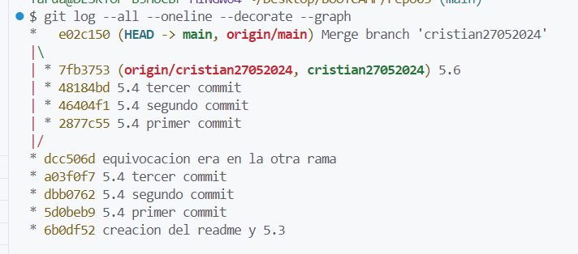
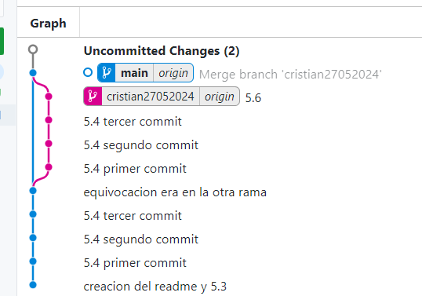
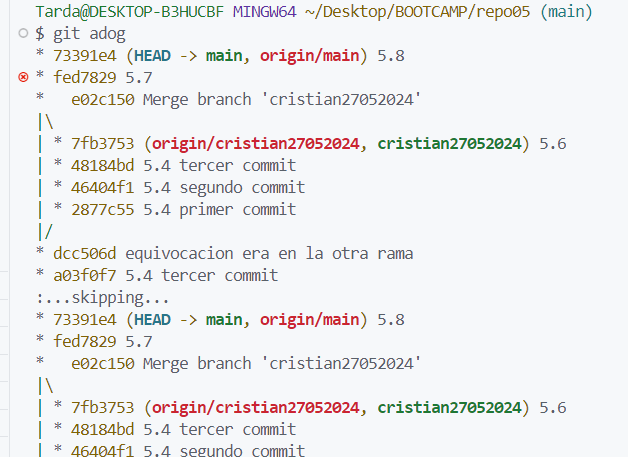

# ex5

3. git checkout -b cristian27052024
4. primer commit, segundo commit, tercer commit
5. (comprobado)
6. git merge --no--ff cristian27052024
7. git log --all --oneline --decorate --graph
    
   

8. Con ff(fast fordward) se introducen los commits por separado tal y como esta en la rama a mergear, sin ff todos los commits se adjuntan en uno. Esto tiene sus ventajas y desventajas, ninguno es mejor que otro, dependerá del contexto.

# ex6

Para crear el alias:

```bash
git config --global alias.adog "log --all --oneline --decorate --graph"
```


